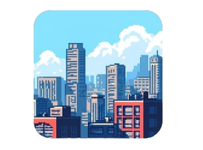

<p align='center'>
  
</p>

<p align="center">
  <a href="https://phaser.io/">
      
  </a>
    <a href="https://heoniverse.netlify.app">
        
    </a>
    <a>
        
    </a>
</p>

<div align="center">

</div>

## 🚀 Introduction

**Heoniverse**는 HTML5 게임 엔진 `Phaser`를 기반으로, 게임 인터페이스를 통해 가상 오피스와 화상회의를 제공하는 몰입형 메타버스 협업 플랫폼입니다. [Gather](https://www.gather.town) 라는 메타버스 서비스에서 영감을 받았으며, [SkyOffice](https://github.com/kevinshen56714/SkyOffice) 라는 오픈소스 프로젝트의 많은 도움을 받았습니다. 플레이어간 실시간 상호작용과 협업 도구를 제공하며, 직관적인 UI와 다양한 인터랙션 요소를 통해 더욱 몰입감 있는 환경을 제공하는 것을 목표로 합니다. 사용자들은 마치 같은 공간에 있는 듯한 소통과 협업을 경험할 수 있습니다.


## ✨ Features
- `Phaser` 기반의 몰입감 있는 게임 인터페이스 
- `Colyseus` 웹소켓 서버 기반의 공개/커스텀 방 생성 및 참여
- `WebRTC` 기반의 영상·음성 통화 
- 거리 기반의 플레이어간 카메라·마이크 자동 연결 
- 플레이어간 전화·채팅 기능을 관리하는 스마트폰 UI
- `MacOS` 환경의 데스크탑 오브젝트를 통한 화면 공유
- `Excalidraw` 기반의 화이트보드 오브젝트로 실시간 아이디어 시각화·공유
- 미니맵, 조이스틱 등의 편의 기능 제공 


## 🎉 Getting Started

- #### 개발 환경 셋업
```sh
# 의존성 설치
pnpm install

# 서버 실행
pnpm dev:server

# 클라이언트 개발 서버 실행 
pnpm dev:client
```

## 🎮 Screenshot 

<details>
<summary>
  <strong>스크린샷을 확인 하려면 펼쳐주세요</strong>
</summary>

![Main Menu][main-screenshot]
![Select Custom Room][select-custom-room-screenshot]
![In-Game][in-game-screenshot]
![Distance Based Chat][distance-based-cat-screenshot]
![Multiple Chat][multiple-chat-screenshot]
![Direct Chat][direct-chat-screenshot]
![Computer Object][computer-screenshot]
![Whiteboard Object][whiteboard-screenshot]

</details>

<!-- Markdown links and Images -->

[main-screenshot]: ./.docs/mainmenu.png
[select-custom-room-screenshot]: ./.docs/select-customroom.png
[in-game-screenshot]: ./.docs/in-game.png
[distance-based-cat-screenshot]: ./.docs/distance-based-chat.png
[multiple-chat-screenshot]: ./.docs/multiple-chat.png
[direct-chat-screenshot]: ./.docs/direct-chat.png
[computer-screenshot]: ./.docs/computer-object.png
[whiteboard-screenshot]: ./.docs/whiteboard-object.png


