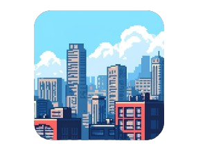
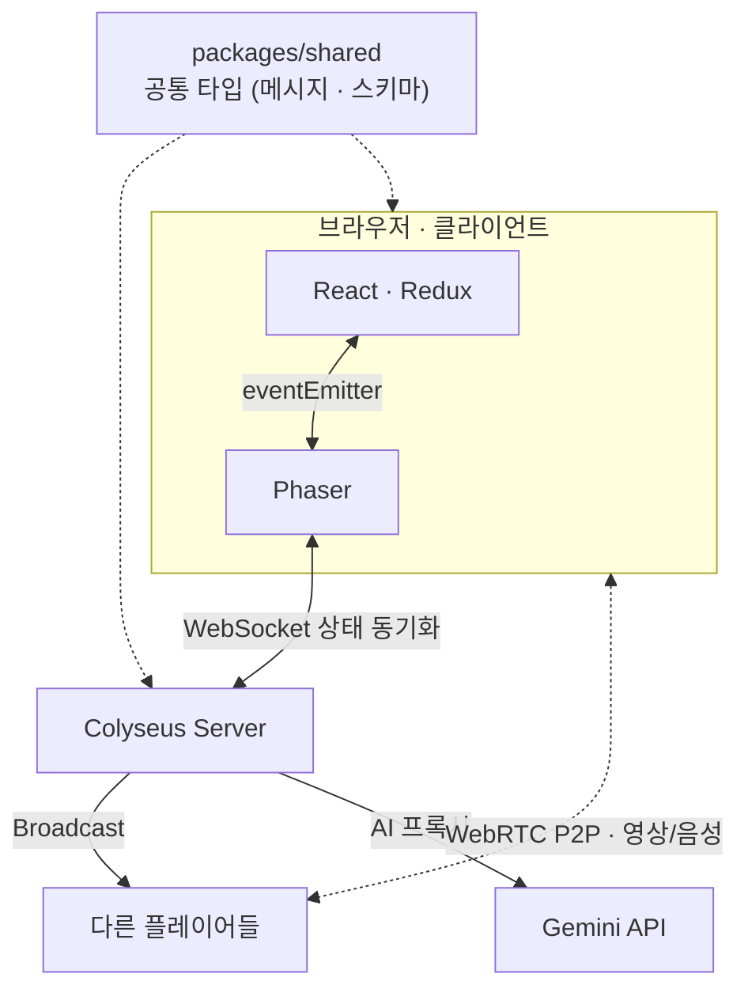

<p align='center'>
  
</p>

<p align="center">
  <a href="https://phaser.io/">
    
  </a>
  <a href="https://colyseus.io/">
    
  </a>
  <a href="https://heoniverse.netlify.app">
    
  </a>
</p>

## 🚀 소개

**Heoniverse**는 HTML5 게임 엔진 `Phaser`를 기반으로, 게임 인터페이스를 통해 가상 오피스와 화상회의를 제공하는 몰입형 메타버스 협업 플랫폼입니다. [Gather](https://www.gather.town)에서 영감을 받아, 여느 원격 협업 도구가 주지 못하는 **게임적 몰입감과 자연스러운 소통 경험**을 목표로 합니다. 플레이어 간 실시간 상호작용과 협업 도구를 제공하며, 직관적인 UI와 다양한 인터랙션으로 마치 같은 공간에 있는 듯한 경험을 제공합니다.

**🔗 라이브 데모** — https://heoniverse.netlify.app

> **notice**: 데스크탑 환경의 브라우저에 최적화되어 있습니다. 모바일에서는 일부 기능이 제한됩니다.

## 🎬 미리보기

![In-Game][in-game-screenshot]

<details>
<summary><strong>스크린샷 더 보기</strong></summary>

![Main Menu][main-screenshot]
![Select Custom Room][select-custom-room-screenshot]
![Distance Based Chat][distance-based-cat-screenshot]
![Multiple Chat][multiple-chat-screenshot]
![Direct Chat][direct-chat-screenshot]
![Computer Object][computer-screenshot]
![Whiteboard Object][whiteboard-screenshot]

</details>

## ✨ 기능

#### 실시간 멀티플레이어 · 협업

- `Colyseus` 웹소켓 서버 기반의 **공개/커스텀 방**(비밀번호 지원) 생성 및 참여
- 플레이어 위치·상태 **실시간 동기화**
- `WebRTC` 기반 **영상·음성 통화**, 거리 기반 카메라·마이크 **자동 연결**
- **거리 기반 스페이셜 오디오** — 가까울수록 크게, 멀어질수록 작아지는 볼륨 감쇠
- `MacOS` 스타일 데스크탑 오브젝트를 통한 **화면 공유**
- `Excalidraw` 기반 **화이트보드** — 실시간 동기화에 더해 **라이브 커서**, 스냅샷 동기화
- `Monaco` + `Yjs` CRDT 기반 **실시간 협업 코드 에디터**로 플레이어끼리 멀티파일 공동 편집

#### 게임 인터랙션

- `Phaser` 기반의 몰입감 있는 게임 인터페이스와 캐릭터 조작
- 의자 앉기, 펀치, 공차기 등 오브젝트/플레이어 상호작용
- **유저 프로필·따라가기·콕 찌르기** — 다른 플레이어와의 소셜 인터랙션
- **감정 표현 이모트** — `G`로 인게임 감정 표현
- **AI 도우미** — 말을 걸면 대답하는 월드 NPC와 데스크탑 **AI 어시스턴트 앱**
- **`MacOS` 가상 데스크탑** — Finder·터미널·사진·협업 에디터 등 실제로 동작하는 앱들
- 전화·채팅·사진·카메라·음악을 담은 **스마트폰 UI**, 미니맵·조이스틱 편의 기능

#### 안정성 · 접근성

- **로그인 없이 즉시 입장** — 회원가입·소셜 로그인 없이 닉네임·아바타만으로 바로 참여
- **새로고침시 재접속** — 메인 메뉴 없이 **이전 방·위치·아바타로 자동 복귀**
- **오프라인 모드** — 서버 없이도 UI·인터랙션을 체험

## 🎮 조작법

| 키                       | 동작                                              |
| ------------------------ | ------------------------------------------------- |
| `W` `A` `S` `D` / 방향키 | 캐릭터 이동                                       |
| `Shift` + 이동           | 달리기(스프린트)                                  |
| `E`                      | 의자 오브젝트 상호작용(앉기/일어나기)             |
| `R`                      | 컴퓨터·화이트보드 상호작용, NPC 대화, 프로필 보기 |
| `Space`                  | 펀치                                              |
| `Enter`                  | 스마트폰 채팅창 열기                              |
| `G`                      | 감정표현                                          |
| `P`                      | 스크린샷 촬영 (사진 앱에 저장)                    |
| `Esc`                    | 스마트폰·팝업 닫기 / NPC 대화 종료                |

우측 하단 HUD의 **나가기** 버튼으로 언제든 메인 메뉴로 돌아갈 수 있습니다.

## 🏗️ 아키텍처

클라이언트·서버·공통 코드를 **모노레포**로 관리합니다. 클라이언트와 서버가 `packages/shared`의 타입(메시지·스키마)을 함께 사용하기 때문에, 둘 사이의 통신 규약이 어긋나면 빌드 단계에서 곧바로 드러납니다.


```mermaid
flowchart TB
    shared["packages/shared<br/>공통 타입 (메시지 · 스키마)"]

    subgraph client ["브라우저 · 클라이언트"]
        direction LR
        React["React · Redux"]
        Phaser["Phaser"]
        React <-->|eventEmitter | Phaser
    end

    server["Colyseus Server"]
    peers["다른 플레이어들"]
    gemini["Gemini API"]

    Phaser <-->|WebSocket 상태 동기화| server
    server -->|Broadcast| peers
    server -->|AI 프록시| gemini
    client <-.->|WebRTC P2P · 영상/음성| peers
    shared -.-> client
    shared -.-> server
```

- **서버가 모든 입력을 검증** — 좌표·닉네임·채팅·아이템 생성 등 모든 입력을 서버가 검증/보정(클라이언트를 신뢰하지 않음)
- **React ↔ Phaser 디커플링** — 타입이 붙은 `eventEmitter` 브리지로 UI와 게임 로직을 분리, 상태는 Redux가 담당
- **게임 상태 · P2P 미디어 분리** — 게임 상태는 Colyseus로, 무거운 영상·음성 스트림은 클라이언트 간 WebRTC 메시로.
- **협업 데이터는 릴레이 + 룸 메모리** — 화이트보드는 요소 스냅샷, 코드 에디터는 `Yjs` CRDT 바이너리를 서버가 중계·보관(룸 수명). DB 없이 늦은 합류 동기화까지 처리.

## 🔧 성능·안정성 개선

| 개선                    | 내용                                                                        |
| ----------------------- | --------------------------------------------------------------------------- |
| ⚡ **초기 로딩 최적화** | 한글 폰트 woff2 서브셋 · 프리로드 제거 · 코드 스플리팅 · 캐시 헤더          |
| 🔌 **WebRTC 누수 제거** | 방 이동 시 남던 `Peer`·미디어 트랙·오디오 루프를 `dispose()`로 일괄 정리    |
| 🔒 **서버 권위화**      | 입력 검증·좌표 clamp·공유자 스푸핑 차단·페이로드 상한, 모니터 basic-auth    |
| 🚀 **런타임 최적화**    | 이동 패킷 60→17 스로틀, 매 프레임 리렌더되던 `GameHUD`를 이벤트 기반으로    |
| 🔁 **새로고침 재접속**  | `allowReconnection` + `sessionStorage`로 새로고침 후 같은 방·위치 자동 복귀 |

## ⚖️ 확장 시 고려사항

> 데모에 맞춰 단순하게 설계하였고 규모를 키운다면 아래를 개선할 수 있습니다.

- **영상·음성은 P2P 풀메시 연결** — 참가자끼리 직접 연결하는 구조라, 한 공간의 인원이 많아질수록 연결 수가 급격히 늘어 부담이 커진다. 대규모 통화가 필요하면 스트림을 중앙에서 중계하는 **SFU(미디어 서버)** 로 바꿔야함
- **WebRTC 시그널링이 PeerJS 공개 클라우드에 의존** — 연결 정보를 무료 공용 브로커로 주고받아 안정성·사용 한도 보장이 없다. 프로덕션에선 자체 **PeerServer** 호스팅으로 안정화해야함
- **서버 상태를 메모리에만 보관** — 방·플레이어 정보를 한 서버의 메모리에 들고 있어, 서버를 재시작하면 진행 중인 방이 사라지고 서버를 여러 대로 늘리기 어렵다. 트래픽이 커지면 **Redis** 같은 공유 저장소로 인스턴스끼리 상태를 나눠야함

## 🎉 설치 및 실행

```sh
# 의존성 설치
pnpm install

# 게임 서버 실행 (Colyseus, localhost:2567)
pnpm dev:server

# 클라이언트 개발 서버 실행 (Vite, localhost:5173)
pnpm dev:client
```

> 로컬 개발 시 클라이언트는 기본으로 `ws://localhost:2567`에 접속하므로 별도의 환경변수가 필요 없습니다.

## 🙏 크레딧

- 픽셀 아트 에셋은 [LimeZu](https://limezu.itch.io) 아티스트님의 에셋을 사용했습니다.
- 프로젝트를 시작하는 데 오픈소스 [SkyOffice](https://github.com/kevinshen56714/SkyOffice)의 많은 도움을 받았습니다.
- 웹에서 `MacOS` 환경을 클론하는 데 [macos-web](https://github.com/puruvj/macos-web) 저장소를 참고했습니다.

<!-- Markdown links and Images -->

[main-screenshot]: ./.docs/mainmenu.png
[select-custom-room-screenshot]: ./.docs/select-customroom.png
[in-game-screenshot]: ./.docs/in-game.png
[distance-based-cat-screenshot]: ./.docs/distance-based-chat.png
[multiple-chat-screenshot]: ./.docs/multiple-chat.png
[direct-chat-screenshot]: ./.docs/direct-chat.png
[computer-screenshot]: ./.docs/computer-object.png
[whiteboard-screenshot]: ./.docs/whiteboard-object.png
